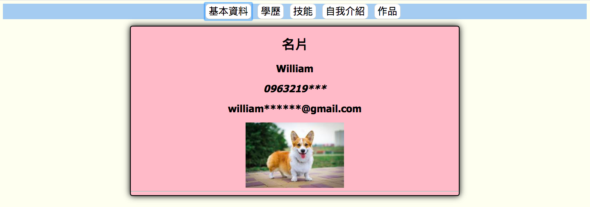

# This is a tutorial of using github

## What we learned
- [x] 貪食蛇
- [x] 網頁設計
- [x] 網頁爬蟲
- [x] 資料分析
- [x] GitHub

## 貪食蛇

### how to use
> cd snake_game  
> python snake.py  

## 網頁設計

### how to launch
> 1. 找到 web_design  資料夾
> 2. 把index.html 用網頁打開
## 網頁爬蟲
練習:[pttnba版](web.spider/nba.csv)
## 資料分析
練習:[武漢肺炎資料](pandas/new_covid19.csv)

---
## what we use
|專案名稱|程式語言|
>|A|B|C|
>|---|---|---|
>|貪食蛇|python|pygmae|
>|網頁|html|css|javescript|
 |網頁爬蟲|python|beautifulsoup|
 |資料分析|python|pandas|

有關動物的Youtube頻道
>|名稱|類型|連結|
>|---|---|---|
>|老人與狗|狗|[連結](https://www.youtube.com/channel/UCZqi-Vq105BcjdttAY3cJVQ)|
>|豆漿|貓|[連結](https://www.youtube.com/channel/UCiXuTOccGliVKpcL1qQWMPg)|
>|華農兄弟|竹鼠|[連結](https://www.youtube.com/channel/UCjEGRKDfUOel8Hp9Iumw5NQ)|

##  